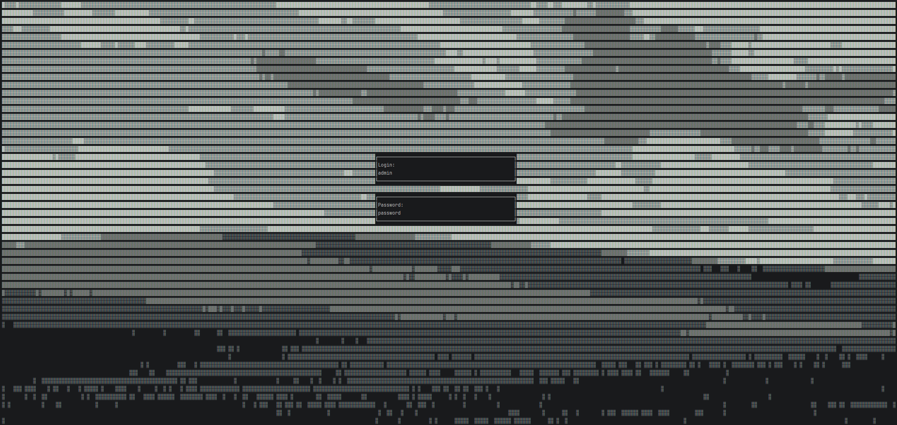

# Welcome to **TUIS**
**TUIS**, short for Terminal User Interface System is, as the name suggest, a UI System for your Terminal entirely made in C#.
  With built-in timed events and an Input system, TUIS is made to be easy to use, light and highly customizable.
---
This is an example of what is possible with TUIS. (more to come)

